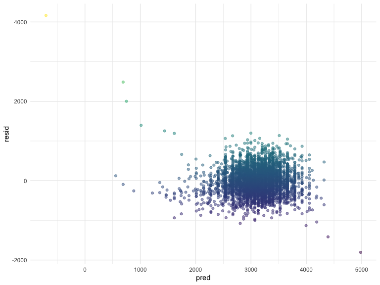
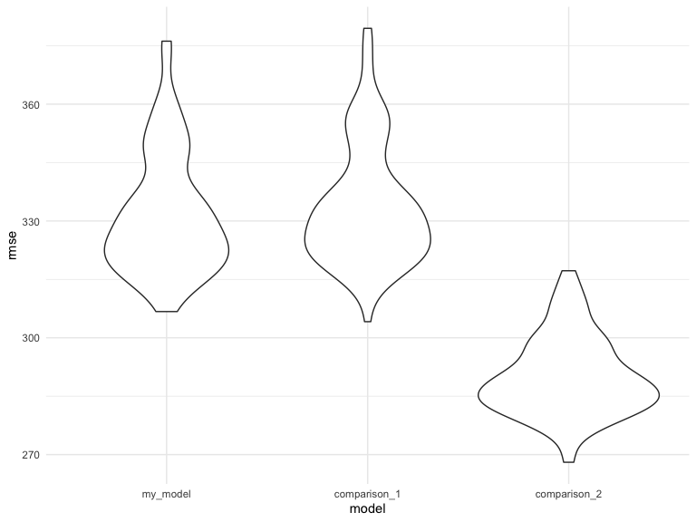
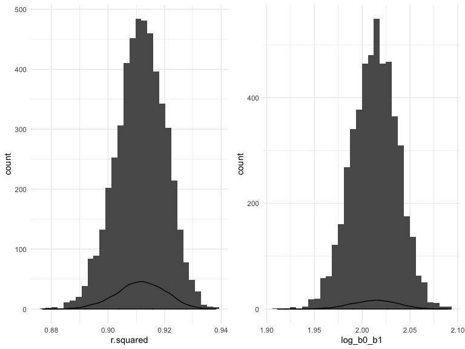

p8105 Homework 6
================
Dionna Attinson
11/21/2019

### Problem 1

#### First, we will load in and clean the data.

``` r
birthweight_data = 
read.csv("./birthweight.csv") %>% 
  mutate(
    mrace = as.factor(mrace), 
    frace = as.factor(frace),
    babysex = as.factor(babysex), 
    malform = as.factor(malform)) %>% 
janitor::clean_names()
```

#### Now, we will propose a regression model. This regression model was chosen through previous research that demonstrates that mother’s race, length at birth, and smoking status impact birthweight.

``` r
fit = lm(bwt ~  smoken + mrace + blength, data = birthweight_data)
summary(fit)
```

    ## 
    ## Call:
    ## lm(formula = bwt ~ smoken + mrace + blength, data = birthweight_data)
    ## 
    ## Residuals:
    ##     Min      1Q  Median      3Q     Max 
    ## -1806.7  -215.4    -3.7   210.7  4163.8 
    ## 
    ## Coefficients:
    ##               Estimate Std. Error t value Pr(>|t|)    
    ## (Intercept) -3349.7518    96.0347 -34.881  < 2e-16 ***
    ## smoken         -5.2378     0.7065  -7.414 1.46e-13 ***
    ## mrace2       -192.8642    11.0071 -17.522  < 2e-16 ***
    ## mrace3       -121.2376    51.0953  -2.373   0.0177 *  
    ## mrace4       -132.9425    22.5632  -5.892 4.10e-09 ***
    ## blength       132.2458     1.8930  69.862  < 2e-16 ***
    ## ---
    ## Signif. codes:  0 '***' 0.001 '**' 0.01 '*' 0.05 '.' 0.1 ' ' 1
    ## 
    ## Residual standard error: 330.8 on 4336 degrees of freedom
    ## Multiple R-squared:  0.5832, Adjusted R-squared:  0.5827 
    ## F-statistic:  1214 on 5 and 4336 DF,  p-value: < 2.2e-16

#### The following code chunk produces a plot of model residuals against fitted values using `add_predictions` and `add_residuals`.

``` r
birthweight_data %>% 
  modelr::add_residuals(fit) %>% 
  modelr::add_predictions(fit) %>% 
  ggplot(aes(x = pred, y = resid, color = resid)) +
  geom_point(alpha = 0.5) + 
  scale_color_viridis() +
  theme_minimal() +
  theme(legend.position = "none")
```



#### Now we will compare this regression models to two other models

  - The first model will use length at birth and gestational age as
    predictors.
  - The second model will use head circumference, length, sex, and all
    interactions (including the three-way interaction) between them.

<!-- end list -->

``` r
model1 = lm(bwt ~ blength + gaweeks, data = birthweight_data)
model2 = lm(bwt ~ bhead + blength + babysex + bhead*blength + bhead*babysex + babysex*blength + bhead*blength*babysex, data = birthweight_data)
```

#### We will then compare the three models in terms of the cross-validated prediction error, using `crossv_mc`.

``` r
cv_df = 
  crossv_mc(birthweight_data, 100) %>% 
  mutate(
    train = map(train, as_tibble),
    test = map(test, as_tibble))
```

``` r
cv_df = cv_df %>%
  mutate(fit = map(train, ~lm(bwt ~ smoken + blength + mrace, data = .x)),
         model1 = map(train, ~lm(bwt ~ blength + gaweeks, data = .x)),
         model2 = map(train, ~lm(bwt ~ bhead + blength + babysex + bhead*blength + blength*babysex + babysex*bhead + bhead*blength*babysex, data = .x))) %>% 
  mutate(rmse_my_model = map2_dbl(fit, test, ~rmse(model = .x, data = .y)),
         rmse_comparison_1 = map2_dbl(model1, test, ~rmse(model = .x, data = .y)),
         rmse_comparison_2 = map2_dbl(model2, test, ~rmse(model = .x, data = .y)))
```

``` r
cv_df %>% 
  select(starts_with("rmse")) %>% 
  pivot_longer(
    everything(),
    names_to = "model", 
    values_to = "rmse",
    names_prefix = "rmse_") %>% 
  mutate(model = fct_inorder(model)) %>% 
  ggplot(aes(x = model, y = rmse)) + geom_violin() + 
  scale_fill_viridis_d(alpha = 0.5) + 
  theme_minimal() + 
  theme(legend.position = "none")
```



#### Through this violin plot, we get a sense of variance in prediction error and can compare prediction error distributions across methods. The comparison 2 model using head circumference, length, sex, and all interactions (including the three-way interaction) between them is the best model in this case.\`

## Problem 2

#### For this problem, we’ll use the 2017 Central Park weather data that we’ve seen elsewhere.

``` r
weather_df = 
  rnoaa::meteo_pull_monitors(
    c("USW00094728"),
    var = c("PRCP", "TMIN", "TMAX"), 
    date_min = "2017-01-01",
    date_max = "2017-12-31") %>%
  mutate(
    name = recode(id, USW00094728 = "CentralPark_NY"),
    tmin = tmin / 10,
    tmax = tmax / 10) %>%
  select(name, id, everything())
```

    ## Registered S3 method overwritten by 'crul':
    ##   method                 from
    ##   as.character.form_file httr

    ## Registered S3 method overwritten by 'hoardr':
    ##   method           from
    ##   print.cache_info httr

    ## file path:          /Users/dionna_attinson/Library/Caches/rnoaa/ghcnd/USW00094728.dly

    ## file last updated:  2019-09-26 10:27:41

    ## file min/max dates: 1869-01-01 / 2019-09-30

#### The code chunk below uses 5000 bootstrap samples. Each sample produces estimates of r² and log(β0\*β1).

``` r
weather_results = 
  weather_df %>% 
  modelr::bootstrap(n = 5000) %>% 
  mutate(
    models = map(strap, ~ lm(tmax ~ tmin, data = .x)),
    results = map(models, broom::tidy),
    glance = map(models, broom::glance)) %>% 
  select(results, glance, .id) %>% 
  unnest(results) %>% 
  pivot_wider( 
    names_from = term,
    values_from = c(estimate, std.error, glance),
    id_cols = .id, 
    ) %>%
  janitor::clean_names() %>%
  unnest(c(glance_intercept), .names_repair = "universal") %>% 
  mutate(
    log_b0_b1 = log(estimate_intercept * estimate_tmin)
  ) 
```

#### The following code chunk plots the distribution of r² and log(β0 \* β1)

``` r
plot1 = weather_results %>% 
  ggplot(aes(x = r.squared)) + 
  geom_histogram() + 
  geom_density() +
  theme_minimal() 
plot2 = weather_results %>% 
  ggplot(aes(x = log_b0_b1)) + 
  geom_histogram() + 
  geom_density() +
  theme_minimal() 

plot1 + plot2
```

    ## `stat_bin()` using `bins = 30`. Pick better value with `binwidth`.
    ## `stat_bin()` using `bins = 30`. Pick better value with `binwidth`.



#### Both the distributions appear to have a normal distrubution. The mean of r² is 0.9115546 and the median of r² is 0.911764. The mean of log(β0 \* β1) is 2.0127482 and the median of log(β0 \* β1) is 2.0137122.

#### The following tables give the 2.5% and 97.5% quantiles for the r² and log(β0 \* β1) for a 95% confidence interval.

``` r
weather_results %>% 
  pull(r.squared) %>% 
  quantile(c(0.025, 0.975)) %>% 
  knitr::kable(col.names = "R-Squared")
```

|       | R-Squared |
| ----- | --------: |
| 2.5%  | 0.8938343 |
| 97.5% | 0.9275407 |

``` r
weather_results %>% 
  pull(log_b0_b1) %>% 
  quantile(c(0.025, 0.975)) %>% 
  knitr::kable(col.names = "Log(B0*B1)")
```

|       | Log(B0\*B1) |
| ----- | ----------: |
| 2.5%  |    1.963457 |
| 97.5% |    2.057466 |
